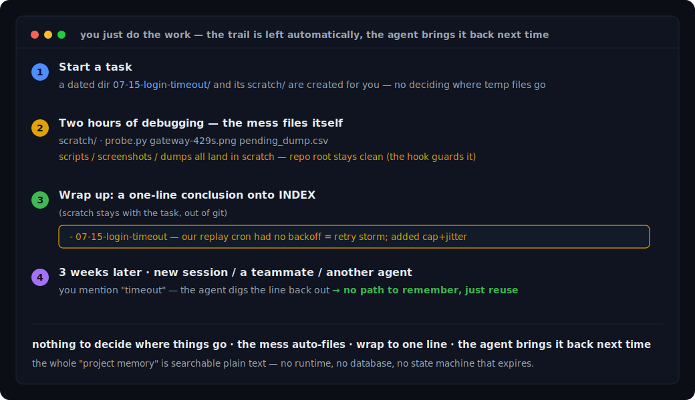
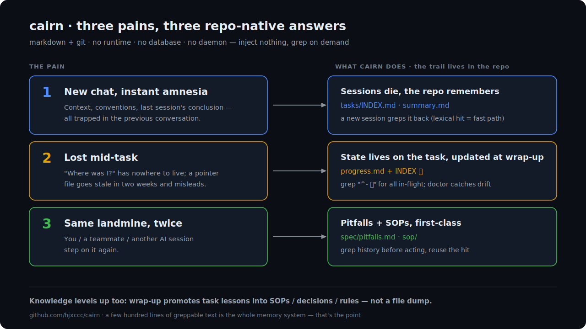
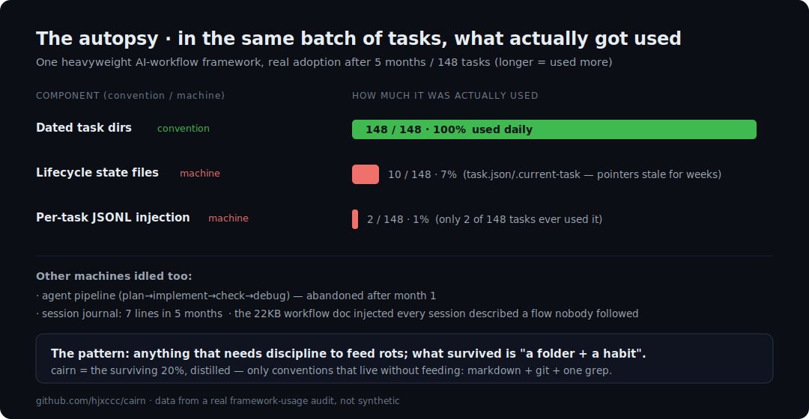

# 🪨 cairn

> A new chat starts from nothing — cairn keeps the project's memory in the repo, so your agent picks it up instead of you re-explaining.

**cairn** is a markdown-native memory & progress layer for AI coding agents (Claude Code, Cursor, Codex, ...). No framework. No runtime. No database. Just directory conventions that keep working after the novelty wears off.

A *cairn* is a stack of stones hikers leave on a trail. It doesn't tell you how to walk — it tells whoever comes next: *someone was here, this path works.*

[中文文档 →](README.zh-CN.md)



## Quick start

**Install it: hand this line to your agent.** In Claude Code, Codex, or any skill-aware agent, say:

> Install cairn and set it up in this project: https://github.com/hjxccc/cairn

It copies the skill, scaffolds `.cairn/` into your project, and wires the root-guard hook. After that, daily use is plain talk too — it creates the task dir, stacks the INDEX line, greps history, logs pitfalls while you say:

> "start a task: fix the login timeout" → "log progress" → "wrap up" → "have we dealt with this before?"

<details>
<summary><b>Prefer to install by hand / no agent?</b></summary>

```bash
git clone https://github.com/hjxccc/cairn
cairn/install.sh /path/to/your-project          # idempotent, never overwrites
```

- **Claude Code**: copy `skill/` to `~/.claude/skills/cairn/` and merge `hooks/settings-hooks.json` into `.claude/settings.json` (append-only).
- **Any agent** (Cursor / Windsurf...): paste `templates/agent-snippet.md` into your `AGENTS.md` — the conventions are just markdown, no hooks required.

</details>

> Prerequisites: `git` + `bash` (Git Bash on Windows); `python3` only for the optional root-guard hook. Full walkthrough with real outputs: [docs/tutorial.md](docs/tutorial.md).

## What it fixes



Working with an AI agent, these three things bite every day:

**① New chat, and the AI has amnesia.** Project context, team conventions, what you actually concluded last time — it's all in the previous conversation, and a fresh session can't see any of it, so you brief it from scratch again.
→ cairn writes these **into the repo** (`INDEX.md`, task summaries, pitfalls, SOPs are all files): sessions close, files don't — in a new session the agent pulls the line back, so you don't re-brief.

**② Halfway through, a new session and "where was I?"** A long task spans days and several conversations, and progress has nowhere solid to live (put it in a pointer file and it's stale in two weeks).
→ cairn keeps progress **on the task's own `progress.md`** with a 🚧 in INDEX: in a new session the agent `grep`s `^- 🚧` to list everything unfinished, reads the matching `progress.md` "next", and picks up from there; `doctor.sh` (read-only) catches drift.

**③ Last month's landmine, stepped on again.** You hit it, a teammate hit it, another AI session is still hitting it — because nobody wrote it where it can be found.
→ cairn makes **pitfalls one-liners and SOPs runnable**: the agent checks the history before acting, reusing the hit instead of re-clearing the same mine.

> One thing in common: **a session ends, the repo doesn't forget.** Chats are volatile; the repo rides along with git. cairn doesn't stuff history into every session (slow and bloated); it leaves the trail in the repo and the agent `grep`s it on demand — why grep and not a vector store is [decision 004](docs/decisions/004-grep-over-vector-search.md).

## cairn vs the usual approaches

Not better on every axis — a different cost model:

| | Manual rules file (`.cursorrules` / `CLAUDE.md`) | Heavy workflow framework | **cairn** |
|---|---|---|---|
| Cross-session memory | none — you re-brief every time | pre-injected (present, but fills context) | trail in the repo, fetched only when you retrieve |
| Session-start cost | light | a spec injected every session (one project measured ~22KB) | ~1.5KB of rules + a tiny pointer |
| Context as history grows | it all piles into the rules file; context grows with it | injected context grows with the rules/state you enable | history stays in the repo; startup context doesn't grow with it — a match reads just that one file |
| Progress / state | nowhere to put it | framework tracks lifecycle state (can go stale) | on the task's `progress.md` + a 🚧 in INDEX (`doctor.sh` flags stale ones) |
| Finding past work | scroll the chat | pre-injected, the line you want is buried | agent `grep` hits (fast path) → miss? read the small index |
| Setup | paste a file | install a framework + config + adapters | one command, or one sentence to your agent |
| Team sharing | one file, everyone's differs | shared inside the framework | layered: personal trail gitignored, team assets committed |
| Platform coupling | tied to one tool | needs a framework protocol + per-platform adapters | core is markdown, platform-independent |
| **cairn's cost · retrieval** | — | — | literal keyword match, not semantic: a rephrase can miss — tags + the small index are the backstop, but no guaranteed hit |
| **cairn's cost · discipline** | — | — | convention, not runtime enforcement: the wrap-up line has to actually get written and the skill actually loaded, or the memory has gaps |

A heavy framework's auto-injection wins when you want zero-effort loading and a strongly enforced process. A single rules file wins for a dead-simple, one-file setup. cairn wins when the work is improvised — debugging, backfills, firefighting — and you want durable, greppable, team-shareable memory with nothing to feed. The bet: pay at retrieval, not on every session.

> **The per-session bill (measured):** cairn's always-on cost is **~350 tok** (a 5-line preamble + your live panel); a heavy framework injects **~5,000–7,000 tok** of static spec every session — **~15–20× more**. cairn's SKILL loads once (~3–4.3k) only when you actually do cairn work, then stops charging. Measure your own: `./.cairn/scripts/cairn-cost.sh`. ([full measurements & method →](docs/token-cost.md))

## What it manages

Six kinds of project knowledge, one shared pattern (*one-line index + detail files*):

| Type | Answers | Lives in | Index |
|---|---|---|---|
| **Task trail** | what did we do, what was the conclusion | `tasks/MM-DD-<topic>/` | `tasks/INDEX.md` |
| **Progress** | where are we, what's blocked | `progress.md` inside long tasks | 🚧 markers in INDEX |
| **SOPs** | how do we do X (repeatable steps) | `sop/` | `sop/index.md` |
| **Decisions** | why is the system like this | `docs/decisions/NNN-*.md` | numbered filenames |
| **Pitfalls & specs** | what bites / detailed conventions | `spec/` | itself / pointer in AGENTS.md |
| **Docs** | designs, write-ups | `docs/` | optional |

```
.cairn/
├── tasks/
│   ├── INDEX.md              # ⭐ one line per task, newest on top
│   └── 07-14-payment-bug/
│       ├── scratch/          # gitignored: debug scripts, dumps, screenshots
│       ├── progress.md       # only for multi-session tasks
│       └── summary.md
├── sop/                      # ⭐ step-by-step procedures agents can execute
├── spec/
│   ├── pitfalls.md           # one line per pitfall, append when bitten
│   └── <topic>.md            # conventions too big for AGENTS.md — pointer there, read on demand
├── docs/decisions/           # lightweight ADRs with supersede links
└── scripts/
    ├── mktmp.sh              # create a task dir in one command
    └── doctor.sh            # flag stale markers, dangling refs, dup slugs, dead links
```

Your whole "project memory" is greppable text — when the agent needs it, `grep 🚧 INDEX.md` is the progress dashboard, `grep -i payment INDEX.md` is "have we solved this before?".

The one failure mode a folder-and-a-habit still has is a `🚧` marker that quietly goes stale (the same way lifecycle pointers rot). `./.cairn/scripts/doctor.sh` is a zero-dependency bash check that flags four kinds of drift: in-flight markers whose task hasn't been touched in N days (default 🚧 14 / ⏸ 60), markers pointing at a task dir that no longer exists, duplicate slugs, and dead links in the index files. It stays *out* of the session hook on purpose — you run it when you want, not every conversation. Across many repos: `for d in */.cairn; do (cd "$d/.." && ./.cairn/scripts/doctor.sh); done`.


**See it in action:** [examples/sample-trail](examples/sample-trail) — a fictional (fully anonymized) two-week trail from a payments team: seven tasks, a retry-storm postmortem, a runbook with a pre-check added after a near-miss, an in-place pitfall revision, and a "why idempotency keys, not Redis locks" decision with the rejected options spelled out. The whole thing is ~150 lines of markdown.

## Why it's shaped this way

From what actually survived, to the principles that follow, to the external grounding:

### The autopsy that started this

We ran a heavy AI workflow framework (the middle column above) on a production multi-repo project for **5 months and 148 tasks**. Then we audited what was actually used:



| Component | Verdict after 5 months |
|---|---|
| Dated task folders (`MM-DD-topic/`) | ✅ 148 tasks, used daily |
| Scratch dir convention + root-guard hook | ✅ the unsung hero |
| Reusable runbooks in plain markdown | ✅ referenced constantly |
| Per-task JSONL context injection | ❌ used by 2 of 148 tasks, then never again |
| Agent pipeline (plan → implement → check → debug) | ❌ abandoned after month one |
| Task lifecycle state files (`task.json`, `.current-task`) | ❌ 10 of 148; pointer stale for weeks |
| Session journals | ❌ 7 lines written in 5 months |
| 22KB of workflow docs injected every session | ❌ described a process nobody followed |

**The pattern:** everything that required discipline to feed the machine died. Everything that was just *a folder and a habit* survived. Real agent-driven work is improvisational — debugging, backfilling, firefighting — not a PRD-driven assembly line.

cairn distills what actually stayed in use — dated task folders, scratch + the root-guard hook, plain-markdown runbooks — plus the three pieces the autopsy showed were missing (decision records, a feedback loop, pitfall revisions). Full story in [docs/philosophy.md](docs/philosophy.md).

### The six principles

1. **The trail lives in the repo, not in a tool.** Markdown + git is the only persistence layer. Built-in agent memory is locked to one machine, keyed to an absolute path, invisible to your team — and its index overflows.
2. **A task is a dated folder.** Creating one is a single command. No lifecycle state machine, no required fields.
3. **Separate dirt from record.** Throwaway artifacts (debug scripts, dumps, venvs — in our audit, 579MB of them) go to gitignored `scratch/`. A hook keeps the repo root clean.
4. **Index + detail, always.** One line in the index, details in their own file. Retrieval is `grep` on the index, then read one file. At a few hundred entries, keyword grep beats a vector DB — this is the correct scale for repo memory.
5. **Retrieve on demand, inject nothing.** Remembering too much is a real failure mode: context stuffing rots. Forgetting = not retrieving. It costs zero.
6. **Conventions over machinery; state lives on the task.** Any mechanism that needs discipline to feed will die. Progress markers live in the index and in the task's own `progress.md` — never in a separate pointer file (ours went stale in two weeks). If a maintenance action takes more than 2 minutes, the design is wrong.

### Grounded, not vibes

The six-type structure maps onto the standard cognitive taxonomy for LLM agents ([CoALA](https://arxiv.org/abs/2309.02427)): task trail = episodic memory, pitfalls/specs = semantic, SOPs = procedural, and the INDEX line is the reflection/compression layer from Generative Agents. The upgrade chain — *task → SOP → skill, pitfall → rule* — is memory consolidation, the "curator" pattern.

On the engineering side it's the repo-native minimal version of practices large orgs already trust: SRE runbooks (our SOP template: trigger / pre-checks / numbered steps with expected output / verify / rollback), blameless postmortems, ADRs with supersede chains, and the Diátaxis split. Details in [docs/grounding.md](docs/grounding.md).

## How is this different from…

| | cairn |
|---|---|
| **Spec-driven frameworks** (Spec Kit, BMAD, ...) | Those orchestrate *planning*; cairn records *what actually happened*. No 5-docs-per-feature ceremony. Use both if you like. |
| **Agent issue trackers** (Beads) | Beads is a dependency-graph DB for parallel agent execution. cairn records the what/why/how as human-readable trails, in plain files. |
| **Markdown kanban** (Backlog.md) | Closest cousin. Backlog.md manages *future* work (boards, statuses); cairn manages *past* knowledge (trails, SOPs, decisions, pitfalls) with a thin progress layer. |
| **Built-in agent memory** | Machine-local, path-locked, not in git, index overflows. cairn keeps team assets in the repo and personal trails portable. |

## FAQ

**Why isn't the personal layer committed by default?**
Task trails are *your* footprints; on a shared repo, everyone committing theirs is pollution. `install.sh` gitignores `tasks/` and `pitfalls.md`; share a specific file deliberately with `git add -f`. Team assets (`sop/`, `spec/<topic>.md`, decisions) are committed normally. ([decision 001](docs/decisions/001-personal-layer-not-in-git.md))

**Where do detailed coding conventions go?**
Not into AGENTS.md — keep that under 200 lines of always-on rules. Detailed conventions live in `spec/<topic>.md` (committed), with a one-line pointer in AGENTS.md ("before touching X, read spec/x.md"). The agent reads the full text on demand — layering without auto-injection.

**Why no CLI tool?**
Because the autopsy says machinery dies. cairn is one 40-line bash script, one optional hook, and conventions. Nothing to update, nothing to break, trivially portable.

**Does it need Claude Code?**
No. The skill and hook are Claude Code sugar. The conventions work with any agent that can read an AGENTS.md — or with no agent at all.

**What about old tasks from before cairn?**
Don't backfill. Half-finished migrations are worse than none. Index forward only; `ls tasks/ | grep` covers the archive.

## Roadmap

- [ ] PowerShell-native install for Windows (Git Bash works today)
- [x] `doctor.sh` — spots stale markers, dangling refs, duplicate slugs, dead links (zero-dep bash, opt-in, not in the session hook)
- [ ] Claude Code plugin packaging
- [ ] Example gallery from real projects

## License

MIT
