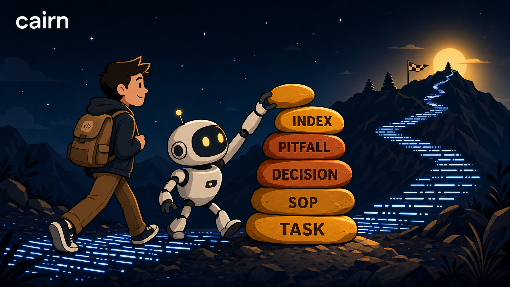
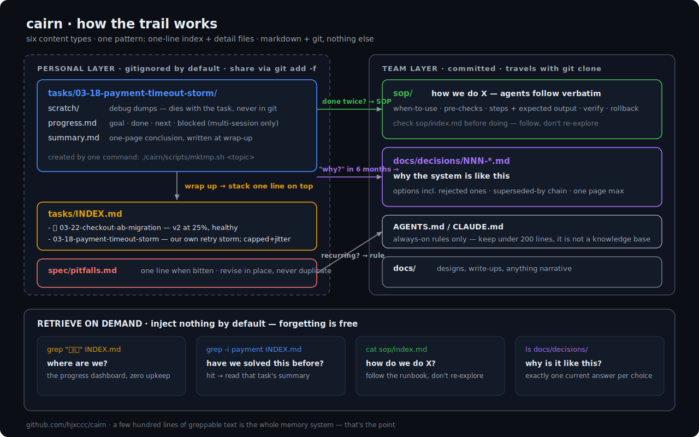

# 🪨 cairn

> The 20% of AI-coding-workflow frameworks that survives contact with real work.

**cairn** is a markdown-native memory & progress layer for AI coding agents (Claude Code, Cursor, Codex, ...). No framework. No runtime. No database. Just directory conventions that keep working after the novelty wears off.

A *cairn* is a stack of stones hikers leave on a trail. It doesn't tell you how to walk — it tells whoever comes next: *someone was here, this path works.*

[中文文档 →](README.zh-CN.md)



---

## The autopsy that started this

We ran a full-featured AI workflow framework on a production multi-repo project for **5 months and 148 tasks**. Then we audited what was actually used:

| Component | Verdict after 5 months |
|---|---|
| Dated task folders (`MM-DD-topic/`) | ✅ 148 tasks, used daily |
| Scratch dir convention + root-guard hook | ✅ the unsung hero |
| Reusable runbooks in plain markdown | ✅ referenced constantly |
| Per-task JSONL context injection | ❌ used by 2 of 148 tasks, then never again |
| Agent pipeline (plan → implement → check → debug) | ❌ abandoned after month one |
| Task lifecycle state files (`task.json`, `.current-task`) | ❌ 10 of 148; pointer stale for weeks |
| Session journals | ❌ 7 lines written in 5 months |
| 22KB of workflow docs injected every session | ❌ described a process nobody followed |

**The pattern:** everything that required discipline to feed the machine died. Everything that was just *a folder and a habit* survived. Real agent-driven work is improvisational — debugging, backfilling, firefighting — not a PRD-driven assembly line.

cairn is the surviving 20%, distilled, plus the three pieces the autopsy showed were missing.

## What it manages

Six kinds of project knowledge, one shared pattern (*one-line index + detail files*):

| Type | Answers | Lives in | Index |
|---|---|---|---|
| **Task trail** | what did we do, what was the conclusion | `tasks/MM-DD-<topic>/` | `tasks/INDEX.md` |
| **Progress** | where are we, what's blocked | `progress.md` inside long tasks | 🚧 markers in INDEX |
| **SOPs** | how do we do X (repeatable steps) | `sop/` | `sop/index.md` |
| **Decisions** | why is the system like this | `docs/decisions/NNN-*.md` | numbered filenames |
| **Pitfalls** | what bites | `spec/pitfalls.md` | itself |
| **Docs** | designs, write-ups | `docs/` | optional |

```
.cairn/
├── tasks/
│   ├── INDEX.md              # ⭐ one line per task, newest on top
│   └── 07-14-payment-bug/
│       ├── scratch/          # gitignored: debug scripts, dumps, screenshots
│       ├── progress.md       # only for multi-session tasks
│       └── summary.md
├── sop/                      # ⭐ step-by-step procedures agents can execute
├── spec/pitfalls.md          # one line per pitfall, append when bitten
├── docs/decisions/           # lightweight ADRs with supersede links
└── scripts/mktmp.sh          # create a task dir in one command
```

Your whole "project memory" is greppable text. `grep 🚧 INDEX.md` is your progress dashboard. `grep -i payment INDEX.md` is your "have we solved this before?".

**See it in action:** [examples/sample-trail](examples/sample-trail) — a fictional (fully anonymized) two-week trail from a payments team: seven tasks, a retry-storm postmortem, a runbook with a pre-check added after a near-miss, an in-place pitfall revision, and a "why idempotency keys, not Redis locks" decision with the rejected options spelled out. The whole thing is ~150 lines of markdown.

## Quick start

```bash
git clone https://github.com/hjxccc/cairn && cd your-project
/path/to/cairn/install.sh .          # scaffolds .cairn/, copies templates & hook
```

Then wire up your agent (one of):

- **Claude Code**: copy `skill/` to `~/.claude/skills/cairn/` — the agent handles "start a task", "log progress", "wrap up", "have we hit this before?", "write an SOP", "log a decision" automatically. Register the root-guard hook from `hooks/settings-hooks.json`.
- **Any agent** (Cursor / Codex / Windsurf...): paste `templates/agent-snippet.md` into your `AGENTS.md` / `CLAUDE.md` / rules file. The conventions are just markdown — no hooks required.

Daily use is four phrases to your agent: *"start a task for X"*, *"log progress"*, *"wrap up"*, *"have we dealt with this before?"*

## The six principles

1. **The trail lives in the repo, not in a tool.** Markdown + git is the only persistence layer. Built-in agent memory is locked to one machine, keyed to an absolute path, invisible to your team — and its index overflows.
2. **A task is a dated folder.** Creating one is a single command. No lifecycle state machine, no required fields.
3. **Separate dirt from record.** Throwaway artifacts (debug scripts, dumps, venvs — in our audit, 579MB of them) go to gitignored `scratch/`. A hook keeps the repo root clean.
4. **Index + detail, always.** One line in the index, details in their own file. Retrieval is `grep` on the index, then read one file. At a few hundred entries, keyword grep beats a vector DB — this is the correct scale for repo memory.
5. **Retrieve on demand, inject nothing.** Remembering too much is a real failure mode: context stuffing rots. Forgetting = not retrieving. It costs zero.
6. **Conventions over machinery; state lives on the task.** Any mechanism that needs discipline to feed will die. Progress markers live in the index and in the task's own `progress.md` — never in a separate pointer file (ours went stale in two weeks). If a maintenance action takes more than 2 minutes, the design is wrong.

## Grounded, not vibes

The six-type structure maps 1:1 onto the standard cognitive taxonomy for LLM agents ([CoALA](https://arxiv.org/abs/2309.02427)): task trail = episodic memory, pitfalls/specs = semantic, SOPs = procedural, and the INDEX line is the reflection/compression layer from Generative Agents. The upgrade chain — *task → SOP → skill, pitfall → rule* — is memory consolidation, the "curator" pattern that shows ~+10% on agent benchmarks.

On the engineering side it's the repo-native minimal version of practices large orgs already trust: SRE runbooks (our SOP template: trigger / pre-checks / numbered steps with expected output / verify / rollback), blameless postmortems, ADRs with supersede chains, and the Diátaxis split. Details in [docs/grounding.md](docs/grounding.md).

## How is this different from…

| | cairn |
|---|---|
| **Spec-driven frameworks** (Spec Kit, BMAD, ...) | Those orchestrate *planning*; cairn records *what actually happened*. No 5-docs-per-feature ceremony. Use both if you like. |
| **Agent issue trackers** (Beads) | Beads is a dependency-graph DB for parallel agent execution. cairn is human-readable archaeology: what/why/how, in files you can read in five years. |
| **Markdown kanban** (Backlog.md) | Closest cousin. Backlog.md manages *future* work (boards, statuses); cairn manages *past* knowledge (trails, SOPs, decisions, pitfalls) with a thin progress layer. |
| **Built-in agent memory** | Machine-local, path-locked, not in git, index overflows. cairn keeps team assets in the repo and personal trails portable. |

## FAQ

**Why isn't the personal layer committed by default?**
Task trails are *your* footprints; on a shared repo, everyone committing theirs is pollution. `install.sh` gitignores `tasks/` and `pitfalls.md`; share a specific file deliberately with `git add -f`. Team assets (`sop/`, `docs/`, decisions) are committed normally. ([decision 001](docs/decisions/001-personal-layer-not-in-git.md))

**Why no CLI tool?**
Because the autopsy says machinery dies. cairn is one 40-line bash script, one optional hook, and conventions. Nothing to update, nothing to break, trivially portable.

**Does it need Claude Code?**
No. The skill and hook are Claude Code sugar. The conventions work with any agent that can read an AGENTS.md — or with no agent at all.

**What about old tasks from before cairn?**
Don't backfill. Half-finished migrations are worse than none. Index forward only; `ls tasks/ | grep` covers the archive.

## Roadmap

- [ ] PowerShell-native install for Windows (Git Bash works today)
- [ ] `cairn doctor` — one script to spot stale 🚧 markers and index drift
- [ ] Claude Code plugin packaging
- [ ] Example gallery from real projects

## License

MIT
