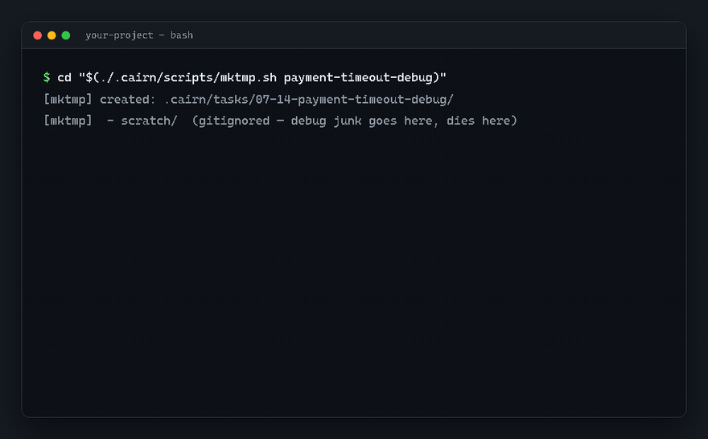

# 🪨 cairn（垒石）

> AI 编码工作流框架里，真正能在实战中活下来的那 20%。

**cairn** 是给 AI 编码 agent（Claude Code / Cursor / Codex …）用的 markdown 原生记忆与进度层。没有框架、没有运行时、没有数据库——只有一套"新鲜感褪去之后仍然在用"的目录约定。

*cairn*（垒石）是登山者在路上垒的石堆路标：它不指挥你怎么走，只告诉后来的人——**有人来过，这条路通**。

[English →](README.md)



## 快速开始

> 前置：`git` + `bash`（Windows 用 Git Bash）；`python3` 只有可选 hook 需要。含真实输出的完整教程：**[docs/tutorial.zh-CN.md](docs/tutorial.zh-CN.md)**。

```bash
git clone https://github.com/hjxccc/cairn
cd 你的项目 && /path/to/cairn/install.sh .    # 铺 .cairn/ 结构、模板和 hook
ls .cairn/ && ./.cairn/scripts/mktmp.sh demo  # 验证：目录都在、能建任务
```

再接上你的 agent（二选一）：

- **Claude Code**：把 `skill/` 拷到 `~/.claude/skills/cairn/`，并按 `hooks/settings-hooks.json` 注册根目录拦截 hook。之后"起个任务 / 记进度 / 收尾 / 以前处理过没 / 写个 SOP / 记个决策"agent 全自动接住。
- **任意 agent**（Cursor / Codex / Windsurf…）：把 `templates/agent-snippet.md` 贴进你的 `AGENTS.md` / 规则文件即可——约定就是 markdown，不依赖 hook。

日常就是对 agent 说四句话：**"起个任务 X"、"记进度"、"收尾"、"以前处理过没"**。

## 管什么

六类项目知识，共用一个模式（**一行索引 + 详情文件**）：

| 类型 | 回答 | 位置 | 索引 |
|---|---|---|---|
| **任务留痕** | 做过什么、结论是什么 | `tasks/MM-DD-<topic>/` | `tasks/INDEX.md` |
| **进度** | 做到哪、卡在哪 | 长任务内 `progress.md` | INDEX 的 🚧 标记 |
| **SOP** | 怎么做 X（可重复步骤） | `sop/` | `sop/index.md` |
| **决策** | 系统为什么长这样 | `docs/decisions/NNN-*.md` | 编号文件名 |
| **坑与规约** | 什么会咬人 / 详细规范 | `spec/` | 自身 / AGENTS.md 指针行 |
| **文档** | 方案、文章 | `docs/` | 可选 |

```
.cairn/
├── tasks/
│   ├── INDEX.md              # ⭐ 一行一任务，新的在上
│   └── 07-14-payment-bug/
│       ├── scratch/          # gitignore：调试脚本、数据、截图
│       ├── progress.md       # 只有跨会话长任务才有
│       └── summary.md
├── sop/                      # ⭐ agent 可照跑的步骤化流程
├── spec/
│   ├── pitfalls.md           # 坑账：踩到当场记一行
│   └── <主题>.md             # CLAUDE.md 放不下的详细规约——那边留指针，按需读
├── docs/decisions/           # 轻量决策记录，带 superseded 链
└── scripts/
    ├── mktmp.sh              # 一条命令起任务
    └── doctor.sh            # 揪过期 🚧 标记 + 悬空 INDEX 引用
```

整个"项目记忆"都是可 grep 的纯文本：`grep 🚧 INDEX.md` 就是进度面板，`grep -i 支付 INDEX.md` 就是"以前处理过没"。

「一个文件夹 + 一个习惯」唯一还会烂的地方，是某个 `🚧` 标记悄悄过期（跟生命周期指针烂掉一个道理）。`./.cairn/scripts/doctor.sh` 是个 ~90 行零依赖 bash，只揪两件事：挂着标记但任务超过 N 天（默认 14）没动、以及标记指向的任务目录已不存在。它**故意不进 SessionStart hook**——你想查才跑，不是每次开会话都跑。跨仓一把梭：`for d in */.cairn; do (cd "$d/.." && ./.cairn/scripts/doctor.sh); done`。


**典型样例**：[examples/sample-trail](examples/sample-trail)——一个虚构（完全脱敏）的支付团队两周足迹：7 个任务、一次重试风暴复盘、一篇"险情后补了前置检查"的 runbook、一次坑账就地修订、一条"为什么用幂等键不用 Redis 锁"的决策（含被否选项）。全部加起来约 150 行 markdown。

## 一切始于一次"尸检"

我们在一个多仓库生产项目上，完整用了 **5 个月、148 个任务**的重型 AI 工作流框架，然后审计了实际使用情况：

| 组件 | 5 个月后的判决 |
|---|---|
| 日期任务目录（`MM-DD-topic/`） | ✅ 148 个，天天在用 |
| scratch 目录约定 + 根目录拦截 hook | ✅ 无名英雄 |
| 纯 markdown 的可复用 runbook | ✅ 高频引用 |
| 按任务的 JSONL 上下文注入 | ❌ 148 个任务只有 2 个用过 |
| agent 流水线（plan→implement→check→debug） | ❌ 第一个月后废弃 |
| 任务生命周期状态文件（task.json / .current-task） | ❌ 148 个只有 10 个；指针过期数周 |
| 会话日志 journal | ❌ 5 个月写了 7 行 |
| 每次会话注入 22KB 工作流文档 | ❌ 描述一个没人走的流程 |

**规律**：凡是需要纪律去喂养机器的，都死了；凡是"一个文件夹 + 一个习惯"的，都活了。真实的 agent 工作是即兴的——排障、补数、救火——不是 PRD 驱动的流水线。

cairn 就是活下来的 20% 的提炼，外加尸检暴露出缺失的三块（决策记录、反馈闭环、坑账修订）。完整故事见 [docs/philosophy.md](docs/philosophy.md)。

## 六条原则

1. **足迹留在 repo，不在工具里**——markdown + git 是唯一持久层。内置 agent 记忆锁死单机、绑定绝对路径、团队不可见、索引会撑爆。
2. **任务 = 日期文件夹**——一条命令建好，无状态机、无必填字段。
3. **脏净分离**——一次性产物（实测 579MB）进 gitignore 的 `scratch/`，hook 保根目录干净。
4. **永远是索引 + 详情**——检索 = grep 索引再读一个文件。几百条量级下 grep 优于向量库，这才是 repo 记忆的正确规模。
5. **按需检索，零注入**——记得太多是真实故障模式。遗忘 = 不检索，成本为零。
6. **约定优先于机器；状态长在任务身上**——进度标记只在 INDEX 和任务自己的 progress.md 里，绝不放独立指针文件（我们的指针两周就烂了）。任何维护动作超过 2 分钟即设计错误。

## 有依据，不是玄学

六类结构与 LLM agent 认知架构标准分类 [CoALA](https://arxiv.org/abs/2309.02427) 一一对应（任务留痕=情景记忆，坑/规约=语义记忆，SOP=程序记忆，INDEX 一行=Generative Agents 的反思压缩层）；升级链（任务→SOP→skill，坑→规则）就是记忆固化的 curator 模式（agent benchmark 实证 ~+10%）。工程侧则是 SRE runbook / blameless postmortem / ADR supersede 链 / Diátaxis 的 repo 内极简版。详见 [docs/grounding.md](docs/grounding.md)。

## 与同类的区别

- **规格驱动框架**（Spec Kit / BMAD）：编排"计划"；cairn 记录"实际发生了什么"。可共存。
- **agent 任务追踪器**（Beads）：面向多 agent 并行执行的依赖图数据库；cairn 是人类可读的考古层——五年后还能读。
- **Markdown 看板**（Backlog.md）：最近的表亲，管"未来的工作"；cairn 管"过去的知识"+ 轻进度层。
- **内置 agent 记忆**：单机、路径锁定、不进 git；cairn 团队资产入仓、个人足迹可迁移。

## FAQ

**为什么个人层默认不进 git？** 任务足迹是个人的，共享仓库里人人提交等于互相污染。install.sh 默认 gitignore `tasks/` 和 `pitfalls.md`，确需共享的单文件 `git add -f` 显式入库；团队资产（sop/、spec/<主题>.md、decisions/）正常提交。（[决策 001](docs/decisions/001-personal-layer-not-in-git.md)）

**详细的编码规范/领域约定放哪？** 不放 AGENTS.md——那里只放 200 行内的"每次必须遵守"。详细规约放 `spec/<主题>.md`（进 git），AGENTS.md 留一行指针（"改 X 前先读 spec/x.md"），agent 按需读全文——要分层，不要自动注入。

**为什么不做 CLI 工具？** 尸检结论：机器会死。cairn 是一个 40 行 bash 脚本 + 一个可选 hook + 约定。没有东西需要升级，没有东西会坏，拷走即迁移。

**必须用 Claude Code 吗？** 不。skill 和 hook 是 Claude Code 的糖；约定本身对任何能读 AGENTS.md 的 agent 都成立——甚至不用 agent 也成立。

**存量老任务怎么办？** 不回填。半途而废的迁移比不迁移更糟。只往前建索引，老档案用 `ls tasks/ | grep` 兜底。

## License

MIT
